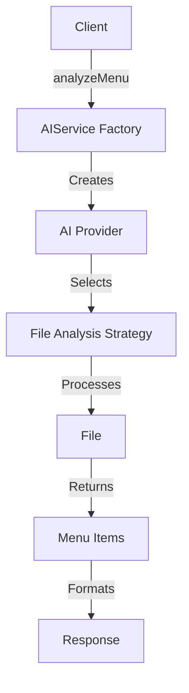
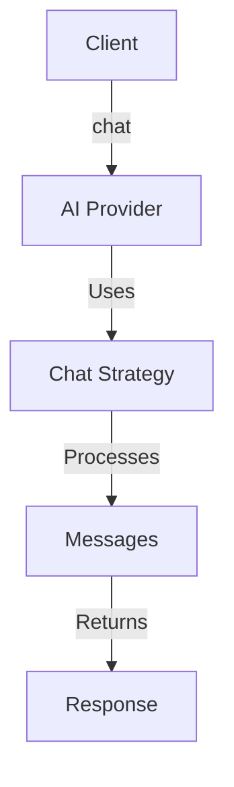

# AI Module Technical Documentation

## Architecture Overview

The AI module implements a flexible and extensible architecture using multiple design patterns to handle different AI providers (Claude, OpenAI) and file analysis capabilities. The core architectural decisions and patterns are detailed below.

## Design Patterns & Implementation Details

### 1. Strategy Pattern Implementation

#### Location: `lib/ai/chat/chat-strategy.ts` & `lib/ai/providers/claude/file-analysis/`

The Strategy pattern is implemented in two key areas:

1. Chat Strategy
2. File Analysis Strategy

#### Why Strategy Pattern?

The Strategy pattern allows us to:
- Encapsulate different AI provider implementations
- Switch between different chat providers without changing client code
- Add new providers without modifying existing code
- Isolate provider-specific logic

```typescript
// Abstract Strategy
abstract class ChatStrategy {
  abstract chat(options: ChatOptions): Promise<ChatResponse>;
}

// Concrete Strategies
class ClaudeChatStrategy extends ChatStrategy {
  async chat(options: ChatOptions): Promise<ChatResponse> {
    // Claude-specific implementation
  }
}

class OpenAIChatStrategy extends ChatStrategy {
  async chat(options: ChatOptions): Promise<ChatResponse> {
    // OpenAI-specific implementation
  }
}

// You can add new Strategies by extending the ChatStrategy class without modifying existing code
class NewChatStrategy extends ChatStrategy {
  async chat(options: ChatOptions): Promise<ChatResponse> {
    // New provider-specific implementation
  }
}
```

#### File Analysis Strategy Implementation

```typescript
// Abstract Strategy
abstract class FileAnalysisStrategy {
  abstract analyzeFile(options: FileAnalysisOptions): Promise<any>;
}

// Concrete Strategies
class PdfAnalysisStrategy implements FileAnalysisStrategy {
  async analyzeFile(options: FileAnalysisOptions) {
    // PDF-specific analysis
  }
}

class ImageAnalysisStrategy implements FileAnalysisStrategy {
  async analyzeFile(options: FileAnalysisOptions) {
    // Image-specific analysis
  }
}
```

#### Benefits
1. **Flexibility**: Easy to add new analysis strategies
2. **Maintainability**: Each strategy is isolated and can be modified independently
3. **Testability**: Strategies can be tested in isolation
4. **Reusability**: Strategies can be reused across different contexts

### 2. Factory Pattern Implementation

#### Location: `lib/ai/service-factory.ts`

The Factory pattern is used to create appropriate AI service instances based on the provider type.

#### Why Factory Pattern?

- Encapsulates object creation logic
- Provides a unified interface for creating different AI providers
- Makes the system more maintainable and extensible

```typescript
export class AIService {
  static createService(type: "claude" | "openai", apiKey: string): AIProvider {
    switch (type) {
      case "claude":
        return new Claude(apiKey);
      case "openai":
        return new Openai(apiKey);
      default:
        throw new Error(`Unsupported AI service type: ${type}`);
    }
  }
}
```

#### Benefits
1. **Encapsulation**: Creation logic is centralized
2. **Flexibility**: Easy to add new providers
3. **Consistency**: Ensures consistent provider initialization

### 3. Template Method Pattern

#### Location: `lib/ai/base-provider.ts`

The Template Method pattern is implemented in the `BaseAIProvider` class to define the skeleton of provider operations.

```typescript
export abstract class BaseAIProvider {
  constructor(protected readonly chatStrategy: ChatStrategy) {}

  abstract analyzeMenu(options: MenuAnalysisOptions): Promise<MenuAnalysisResponse>;
  abstract getPrompt(language: string): string;

  async chat(options: ChatOptions): Promise<ChatResponse> {
    return this.chatStrategy.chat(options);
  }
}
```

#### Benefits
1. **Code Reuse**: Common functionality is implemented once
2. **Consistency**: Ensures consistent behavior across providers
3. **Extensibility**: Easy to add new provider-specific functionality

## System Flow

### Menu Analysis Flow



### Chat Flow



## Performance Considerations

1. **File Analysis**
    - Implements lazy loading of strategies
    - Uses Map for O(1) strategy lookup
    - Caches analysis results when possible

2. **Chat Implementation**
    - Configurable token limits
    - Adjustable temperature settings
    - Optimized prompt templates

## Error Handling

The module implements comprehensive error handling:

```typescript
try {
  const strategy = this.fileAnalysisStrategies.get(mimeType);

  if (!strategy) {
    this.logger.error("Unsupported file type", { mimeType });
    throw new Error(`Unsupported file type: ${mimeType}`);
  }

  // ... analysis logic

} catch (error) {
  this.logger.error("Error analyzing menu", { error });
  throw error;
}
```

## Extension Points

The system can be extended in several ways:

1. **New AI Providers**
    - Implement BaseAIProvider
    - Add to AIService factory
    - Implement required strategies

2. **New File Types**
    - Create new FileAnalysisStrategy
    - Add to strategy map in provider

3. **New Chat Capabilities**
    - Extend ChatStrategy
    - Implement in provider

## Future Improvements

1. **Rate Limiting**
    - Add provider-specific rate limiting
    - Implement retry mechanisms

3. **Monitoring**
    - Add performance metrics
    - Implement telemetry
